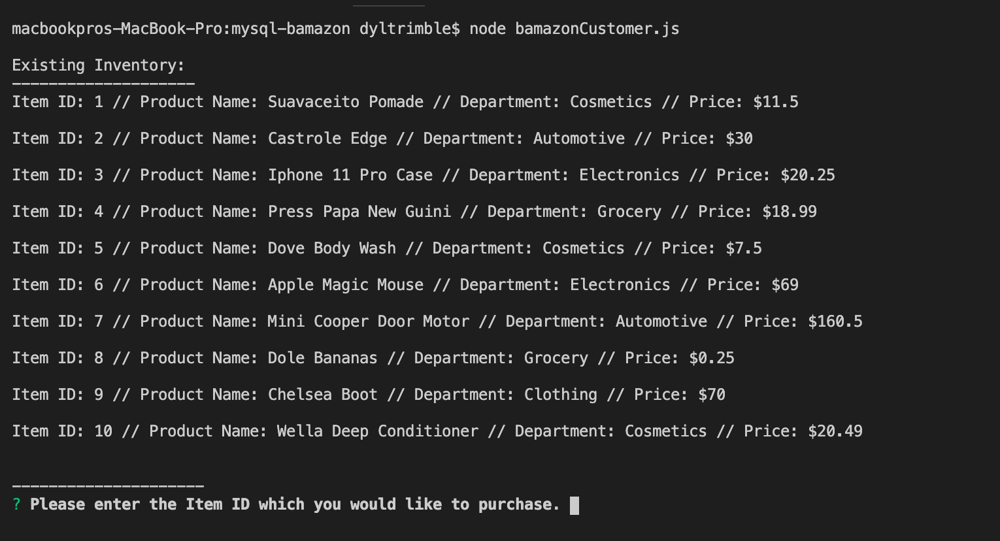
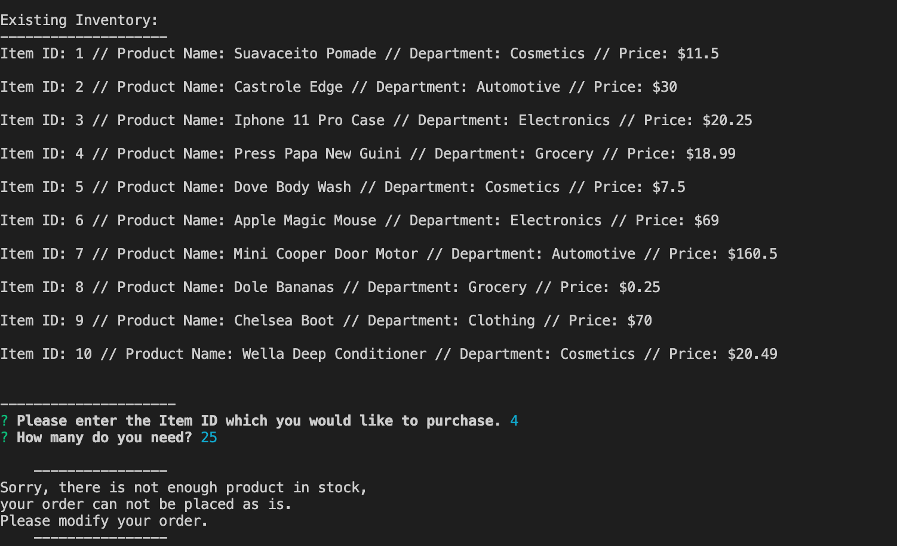
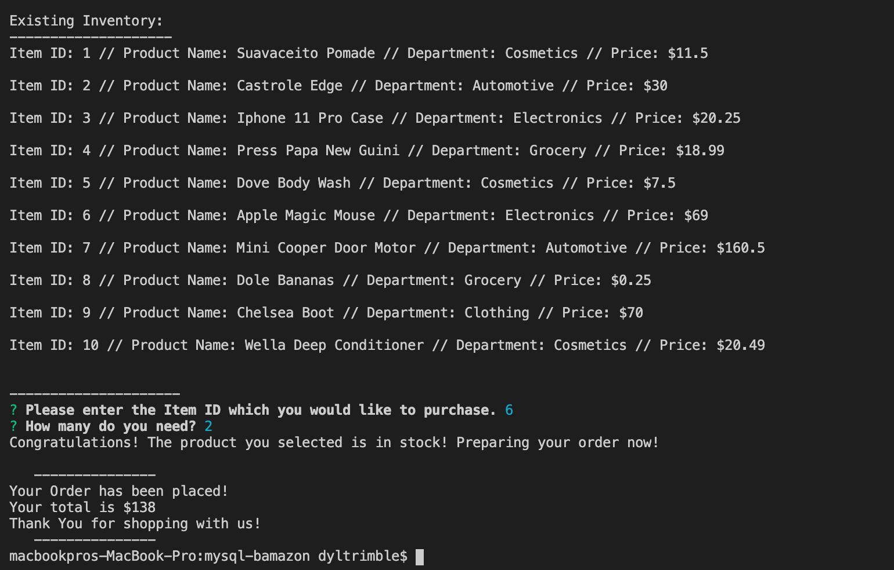

# Bamazon

## Description

This application implements a simple command line based storefront using the npm [inquirer](https://www.npmjs.com/package/inquirer) package and the MySQL database backend together with the npm [mysql](https://www.npmjs.com/package/mysql) package. The application currently runs a customer interface, with plans to add manager and supervisor interfaces in the future. 

In order to run this application, you should have the MySQL database already set up on your machine.

### Customer Interface

The customer interface allows the user to view the current inventory of store items: item IDs, descriptions, department in which the item is located and price. The user is then able to purchase one of the existing items by entering the item ID and the desired quantity. If the selected quantity is currently in stock, the user's order is fulfilled, displaying the total purchase price and updating the store database. If the desired quantity is not available, the user is prompted to modify their order.

To run the customer interface please follow the steps below:

	git clone https://github.com/dylantrimble/mysql-bamazon.git
	cd bamazon
	npm i mysql
    npm i inquirer
	node bamazonCustomer.js

#### You will then be greated with this interface:

This is the initial screen you will be greeted with, asking you to elect a product from inventory.

Next you will be asked to selct your desir1ed product quantity.

If there is not enough quantity of the desired product it will notify you of the issue redirect you to retry your order.

However if there was enough product to fulfill your order you will get an order success screen with order info and the app will end.

